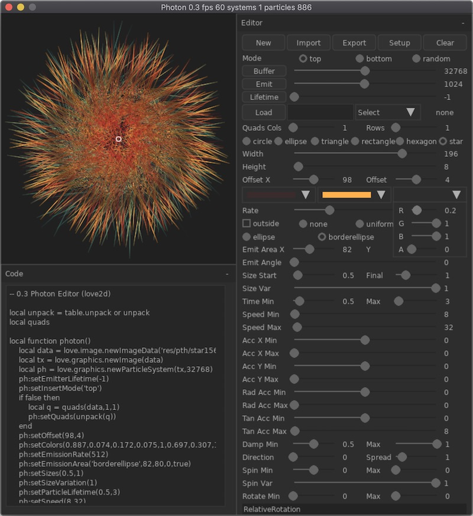

# Photon-LÖVE

Particle Editor for Love2d.

v1.0

'New' - create new particle system.

'Clone' - clone current system.

'Export' - save code & image in separate folder for use with Love2d.

'Delete' - delete particle system.

New systems immediately emit particles. If you press 'Pause' system just stop update iternal state. If you press 'Stop' system finish produce particles but continue update state, even if all particles disappear. If you press 'Start' current system continue emission or start it again.

'Reset' - delete all particles, reset values for buffer and lifetime counter.

'Setup' - edit current particle system.

'Mark' - show and hide marks in the display.

# Buffer & Lifetime

You can set Buffer size and Lifetime counter when create new system. To change values you need press 'Reset' for selected system.

# Export

Particle system exported with 'pht' extension. It is plain lua file which can used with 'require' or other import facilities.

# Import texture

Drag & Drop image. Image automatically apply for the current system.

You can find imported images in the Texture section of the editor.

# Import Photon file '.pht'

Drag & Drop '.pht' file and editor generate default texture for your script.

Drag & Drop '.pht' file together with '.png' or '.jpg' file.

After editor automatically run imported particle system.

# Warning

Shared library nuklear.so compiled for Mac OS 64-bit.

Made with Nuklear, Love2d and some self-made libraries on top of Love Engine.

To run source code: clone repository, download & install [LÖVE 11.2](https://love2d.org) for you system and run photon.love.

