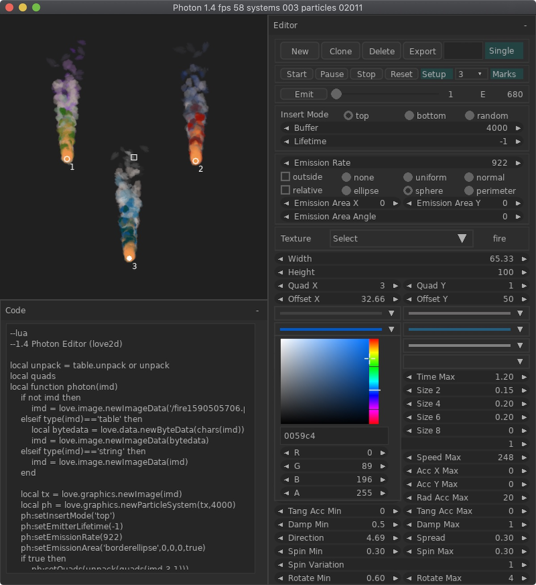

# Photon

v1.5

Particle Editor for Love2d.

Made with Nuklear, Love2d and some self-made libraries on top of Love Engine.

[Release available for Mac OS 64-bit, Windows 64-bit & for Windows 32-bit](https://github.com/schwarzbox/Photon/releases)

To run source code: clone repository, download & install [LÖVE 11.3](https://love2d.org) for you system and run photon.love

# Warning

Include nuklear in your PATH

Use nuklear/nuklear.dll for Windows32

Use nuklear/nuklear.so for Mac OS 10.15.4 (Catalina) 64-bit


## UI

'New' - create new particle system.

'Clone' - clone current system.

'Delete' - delete particle system.

'Export'

- Acivate 'Single' mode (save file '.pht.png' which include particle system)

- Deactivate 'Single' mode (save file '.pht' & image in separate folder)

New system immediately emit particles.

'Start' - start system (auto start by default)

'Pause' - stop produce particles.

'Stop' - stop system and reset lifetime.

'Reset' - delete all particles, reset values for buffer and lifetime counter.

'Setup' - edit current particle system.

'1 ... n' - select system to edit.

'Mark' - show and hide marks in the display.

## Buffer & Lifetime

You can set Buffer size and Lifetime counter when create new system. To change values for exist system you need press 'Reset' for selected system.

## Import image

Drag & Drop image. Image automatically apply for the current system.

You can find imported images in the Texture section of the editor.

You can't change dimension of imported image.

## Import Photon file '.pht.png'

Drag & Drop '.pht.png' file and editor unpack file and run code with texture.

## Import Photon file '.pht'

Drag & Drop '.pht' file and editor generate default texture for your script.

Drag & Drop '.pht' file together with '.png' or '.jpg' file.

Editor automatically run imported particle system. Look for  imported texture in the Texture section of the editor



## Export & use with Love2d

- Activate Single mode

Particle system saved as single file with '.pht.png' extension. Before use you need to decode this file.

``` lua
local function decode(path)
    local file = love.filesystem.newFile(path,'r')
    local all = file:read()
    file:close()
    local indcode, _ = all:find('--lua')
    local cd = all:sub(indcode, #all)

    local indimg, _ = all:find('PNG', 8)
    local chars = all:sub(indimg-1, indcode-1)

    local result = {}
    for i=1,#chars do
        result[#result+1]=tostring(string.byte(chars:sub(i,i)))
    end
    return load(cd)(result)
end
local particleSystem = decode('example.pht.png')
```

Function return ready to use particle system.

- Deactivate Single mode

Files exported in separate folder. Particle system saved with '.pht' extension. It is plain lua file which can used with 'require' or other import facilities. Image file saved as standart '.png' file.

You can provide default path for particle system in editor/set.lua.
Use constant DEFPATH = 'res/pht'

The 'example.pht' and 'example.png' must have same name.

If you want to change names you also must edit code in file 'example.pht'.

``` lua
local particleSystem = love.filesystem.load('example.pht')()
```

You can provide custom image or custom path.

``` lua
local particleSystem = love.filesystem.load('example.pht')('res/pht/custom.png')
```

- Copy/Paste code

Right click on code in 'Code' window to copy.

Manualy provide custom image.

