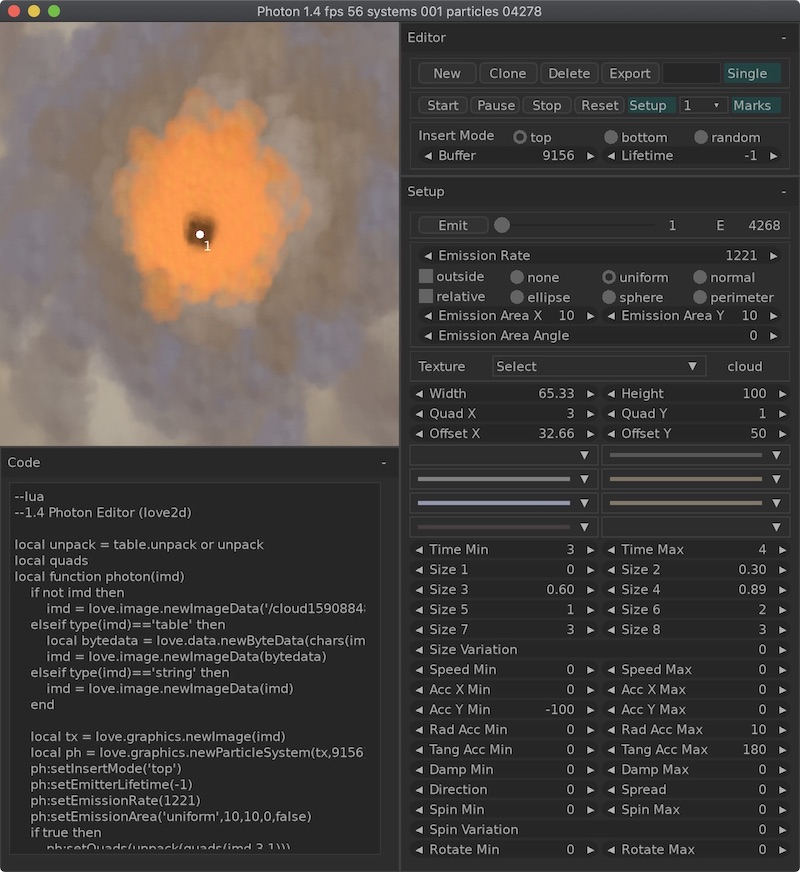

# Photon-LÖVE

Particle Editor for Love2d.

WIP

v0.45

'New' - create new particle system.

'Import' - not yet implemented.

'Export' - save code & image in separate folder for use with Love2d.

'Clear' - remove all particle systems.

New systems immediately emit particles. If you press 'Pause' system just stop update iternal state. If you press 'Stop' system finish produce particles but continue update state, even if all particles disappear. If you press 'Start' current system continue emission or start it again.

'Reset' - delete all particles, reset values for buffer and lifetime counter.

'Setup' - default hot-reload for edit existing particle system.

# Buffer & Lifetime

You can set Buffer size and Lifetime counter when create new system. To change values you need press 'Reset' for selected system.

# Import image

1 Provide path in source folder and press 'Load' button.

2 Drag & Drop image.

# Warning

Shared library nuklear.so compiled for Mac OS 64-bit.

Made with Nuklear, Love2d and some self-made libraries on top of Love Engine.

To run source code: clone repository, download & install [LÖVE 11.2](https://love2d.org) for you system and run photon.love.

